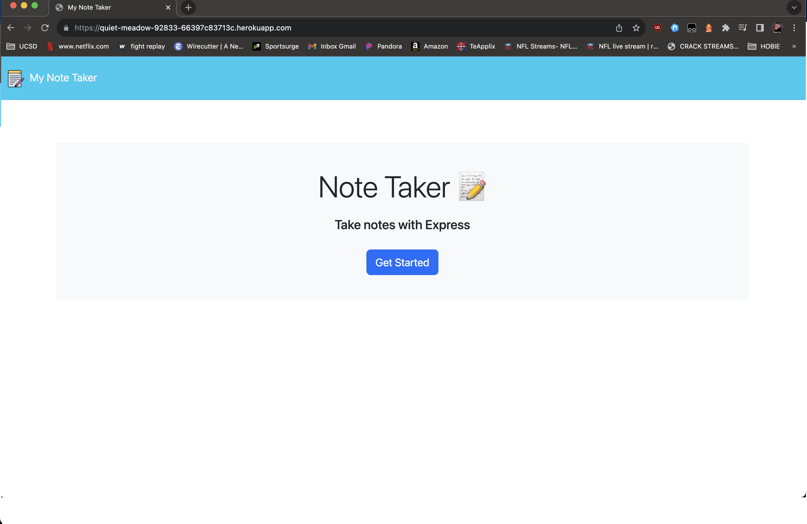
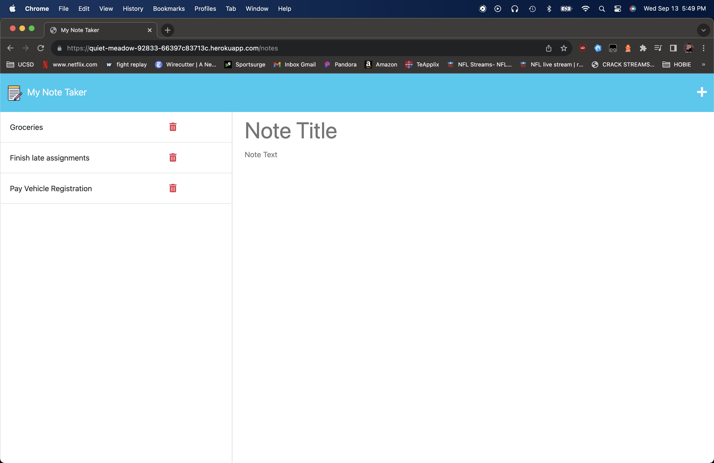

# My Note Taker
[](https://opensource.org/licenses/MIT)


  
## Description

This is a simple Expresss.js application that can be used to write and save notes. The application will use an Express back end and will save and retrieve note data from a JSON file. Connect the pre-made front-end to a newly built back-end and then deploy the application to Heroku live.

## Table of Contents:
- [Overview](#Overview)
- [The Challenge](#The-Challenge)
- [User Story](#User-Story)
- [Installation Process](#Installation-Process)
- [Built With](#Built-With)
- [Knowledge Gained](#Knowledge-Gained)
- [Future Development](#Future-Development)
- [License](#Copyright)
- [Author](#Author)
<!-- - [Acknowledgments](#Acknowledgments) -->

# Overview

## The Challenge:

Your assignment is to modify starter code to create an application called Note Taker that can be used to write and save notes. This application will use an Express.js back end and will save and retrieve note data from a JSON file.

The application’s front end has already been created. It's your job to build the back end, connect the two, and then deploy the entire application to Heroku.

## User Story

```md
AS A small business owner
I WANT to be able to write and save notes
SO THAT I can organize my thoughts and keep track of tasks I need to complete
```

## Acceptance Criteria

```md
GIVEN a note-taking application
WHEN I open the Note Taker
THEN I am presented with a landing page with a link to a notes page
WHEN I click on the link to the notes page
THEN I am presented with a page with existing notes listed in the left-hand column, plus empty fields to enter a new note title and the note’s text in the right-hand column
WHEN I enter a new note title and the note’s text
THEN a Save icon appears in the navigation at the top of the page
WHEN I click on the Save icon
THEN the new note I have entered is saved and appears in the left-hand column with the other existing notes
WHEN I click on an existing note in the list in the left-hand column
THEN that note appears in the right-hand column
WHEN I click on the Write icon in the navigation at the top of the page
THEN I am presented with empty fields to enter a new note title and the note’s text in the right-hand column
```
## GIF:
### 

The following animation demonstrates the applications functionality:


## Usage Instructions
1. Live Deployed App on Heroku: [](https://quiet-meadow-92833-66397c83713c.herokuapp.com/)
2. Click "Get Started" to open My Note Taker.
3. Enter text into the 'title' and 'text' fields 
4. Click the save icon (top right floppy disc icon) to save the note.
5. Click the + icon (top right plus sign) to add another note.
6. To remove a note, click the trash icon to delete saved notes.

## Deployed Application Link:
[Deployed Application Link:](https://quiet-meadow-92833-66397c83713c.herokuapp.com/)

<!-- ## YouTube Walkthrough Video:
[Click Here to Watch](TBD) -->

## Screenshots:
### Figures: 1 & 2
 
 

## Installation Process
1. Clone the Repository from GitHub 
2. (or) Download Zip Folder from Repository from GitHub
3. Open the cloned (or downloaded) repository in any source code editor.
4. Open the integrated terminal for the app's main directory 'Develop' and run the following in order:

```console
npm i
npm start
  or
node server.js
```
5. Navigate to http://127.0.0.1:3001/ or http://localhost:3001 respectively.

## Built With
- JSON:[ JSON](https://www.npmjs.com/package/json)
- Heroku:[ Heroku ](https://www.heroku.com/)
- Dynamic JavaScript
- Node.js [ 16.18.1](https://nodejs.org/en/blog/release/v16.18.1/)
- Express.js:[ Express.js](https://expressjs.com/en/starter/installing.html)
- License Badge: [ Shields.io](https://shields.io/)
- Visual Studio Code: [ Website](https://code.visualstudio.com/)
- ChatGPT: [ OpenAI](https://chat.openai.com/)
- YouTube: [ Website](https://www.youtube.com/)
- Stack Overflow: [ Website](https://stackoverflow.com/)

## Knowledge Gained
- I learned how connect a back-end to a front-end.
- Creating api routes and html routes.
- Deployment to Heroku from the command line interface.

### Future Development:
1. Add time stamps/dates for notes.
2. Add a sort feature by date added/name/importance.
3. Learn more about Express apps in general.

##  License
  
[](https://opensource.org/licenses/MIT) [Open Source Initiative Link](https://opensource.org/licenses/MIT)

### Copyright © 2023 Nathan Weekley
```md
Permission is hereby granted, free of charge, to any person obtaining a copy
of this software and associated documentation files (the "Software"), to deal
in the Software without restriction, including without limitation the rights
to use, copy, modify, merge, publish, distribute, sublicense, and/or sell
copies of the Software, and to permit persons to whom the Software is
furnished to do so, subject to the following conditions:

The above copyright notice and this permission notice shall be included in all
copies or substantial portions of the Software.

THE SOFTWARE IS PROVIDED "AS IS", WITHOUT WARRANTY OF ANY KIND, EXPRESS OR
IMPLIED, INCLUDING BUT NOT LIMITED TO THE WARRANTIES OF MERCHANTABILITY,
FITNESS FOR A PARTICULAR PURPOSE AND NONINFRINGEMENT. IN NO EVENT SHALL THE
AUTHORS OR COPYRIGHT HOLDERS BE LIABLE FOR ANY CLAIM, DAMAGES OR OTHER
LIABILITY, WHETHER IN AN ACTION OF CONTRACT, TORT OR OTHERWISE, ARISING FROM,
OUT OF OR IN CONNECTION WITH THE SOFTWARE OR THE USE OR OTHER DEALINGS IN THE
SOFTWARE.
```

## Author

© 2023 [Nathan Weekley](https://github.com/Nweekley84). Confidential and Proprietary. All Rights Reserved.

---
<br>

<div align="center">

[](https://github.com/Nweekley84) 

</div>